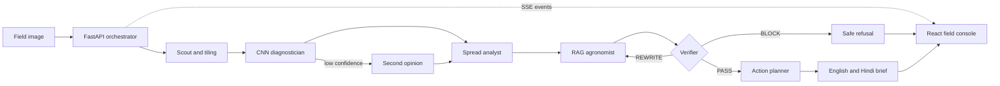

# AgriSentinel

AgriSentinel turns a crop-field image into a verified action plan. It divides the field into tiles, classifies disease per tile, maps spread, drafts source-grounded treatment guidance, and lets a Verifier agent revise or block unsafe advice before a farmer brief is shown. The prototype supports tomato, potato, and corn; out-of-scope cases are refused rather than guessed.

## Architecture



The browser renders the same frozen run-state contract for both live API runs and offline recorded replays. The Verifier is a veto boundary: a diagnosis may still be displayed when treatment advice is blocked.

## Quick start

Requirements: Node.js 20+, npm, Python 3.11+, and a POSIX shell.

### Frontend with the contract mock

```bash
# terminal 1, from the repository root
node contract/mock_server.mjs --fast

# terminal 2
cd frontend
npm install
cp .env.example .env
npm run dev
```

Open `http://localhost:5173`, then upload a JPEG or PNG. The frontend expects `VITE_API_URL=http://localhost:8000` by default.

### Backend scaffold

```bash
# from the repository root
python3 -m venv .venv
.venv/bin/pip install -r backend/requirements.txt
cd backend
../.venv/bin/uvicorn app.main:app --reload --port 8000
```

The API health endpoint is `http://localhost:8000/api/health`; interactive FastAPI docs are at `http://localhost:8000/docs`. Run either the real backend or the contract mock on port 8000, not both.

### Backend-free demo mode

```bash
cd frontend
npm install
VITE_DEMO_MODE=true npm run dev
```

No backend or network connection is required. The first recorded run starts automatically; press `1` for light infection, `2` for heavy infection, or `3` for the clean out-of-scope BLOCK case. Validate all recordings with `npm run verify:demo`.

## What the demo shows

- Progressive 8 × 5 disease heatmap and confidence escalation
- Live nine-agent activity pipeline over server-sent events or an offline timer
- Spread severity, direction, clusters, and estimated yield-loss impact
- Source-grounded treatment plan with visible Verifier rewrite/refusal states
- Day-by-day action timeline, INR estimate, rescan date, and EN/HI farmer brief

## Screenshots

The dashboard screenshot belongs at `docs/screenshots/dashboard.png` after the first real-field run. It is intentionally not fabricated from the synthetic offline mosaics. See `docs/screenshots/README.md` for the capture checklist.

## Evidence and limitations

The committed demo mosaics are visibly labelled synthetic fixtures for backend-failure insurance; they are not field evidence. Model metrics under `ml/artifacts/` come from a clean PlantVillage test split and must not be presented as real-field accuracy. The real-photo collection, visual end-to-end passes, backup video, and rehearsal are tracked in `demo/PRESENTATION_CHECKLIST.md`.

## Repository map

| Path | Purpose |
|---|---|
| `contract/` | Frozen API schema, example run, and mock server |
| `backend/`, `agents/`, `ml/` | Dev A API, orchestration, and model work |
| `frontend/` | Dev B React field console |
| `demo/` | Offline recordings, mosaics, verification, and runbook |
| `docs/` | Presentation deck and screenshots |

## Deployment

For the self-contained VPS Docker Compose setup with Caddy, see
[`DEPLOYMENT.md`](DEPLOYMENT.md).
