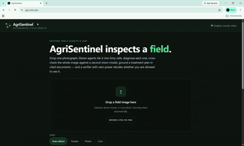
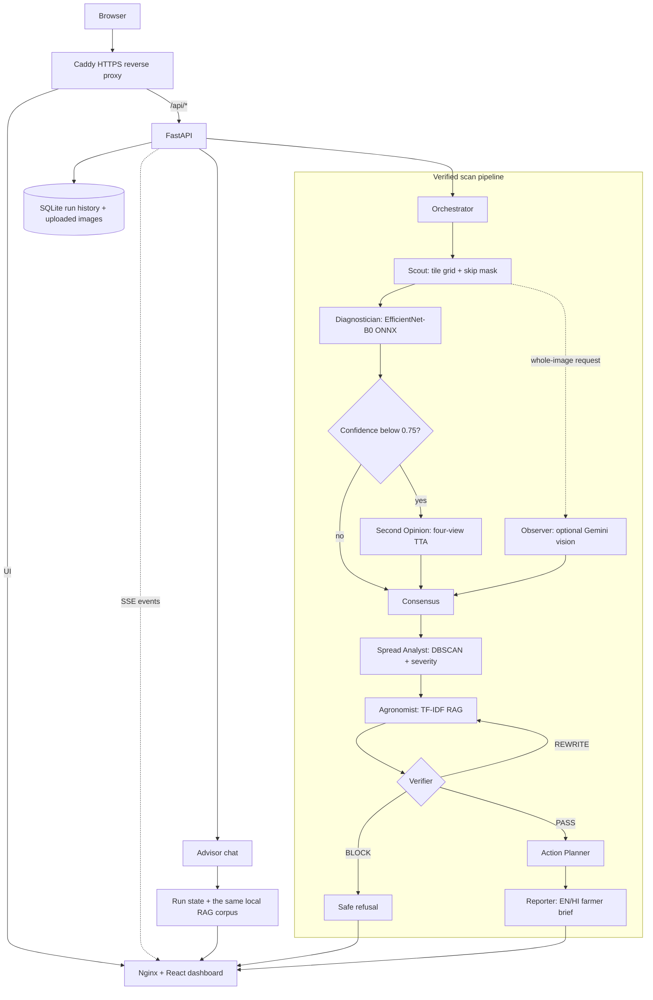
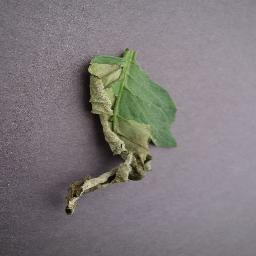
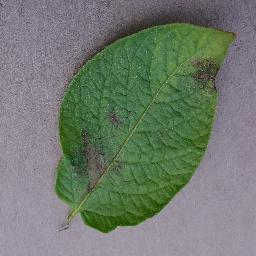
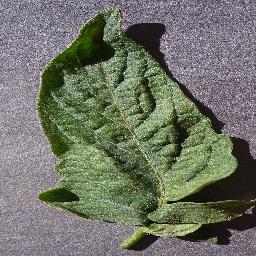

# AgriSentinel



AgriSentinel turns a crop-field image into a verified action plan. It divides the image into
tiles, classifies disease per tile, maps the affected area, drafts source-grounded treatment
guidance, and lets a Verifier revise or block unsafe advice before a farmer brief is shown.
The current prototype supports tomato, potato, and corn and refuses unsupported cases instead
of guessing.

[Open the live app](https://agri.vishu.dev) · [Open the demo GIF](demo.gif?raw=1)

> **Built with ANTIGRAVITY.** AgriSentinel was created using **ANTIGRAVITY** as the primary
> agentic development environment across system design, implementation, integration, testing,
> and deployment. This repository contains the resulting data pipeline, trained model,
> orchestration and safety logic, frontend, backend, and production Docker stack.

## What the app does

- Builds a progressive disease heatmap over an 8 × 5 field grid.
- Runs local EfficientNet-B0 inference through ONNX Runtime on CPU.
- Escalates tiles below the 0.75 confidence gate to a four-view second opinion.
- Optionally cross-checks the whole image with a Gemini vision model and reconciles disagreement.
- Calculates affected area, infection clusters, spread direction, and estimated yield-loss impact.
- Retrieves crop- and disease-specific guidance from a local agronomy corpus.
- Verifies citations, chemical allowlists, and dose rules before releasing advice.
- Produces a treatment plan, schedule, INR cost band, rescan date, and English/Hindi brief.
- Streams each pipeline event to the React dashboard with Server-Sent Events (SSE).
- Supports cited follow-up chat about a completed scan.
- Includes offline recorded runs so the core demonstration works without a backend or network.

## System architecture



Agents do not call one another directly. Each stage reads and updates the shared `RunState`,
while `agents/orchestrator.py` owns execution order, confidence escalation, the
Verifier–Agronomist rewrite loop, and final completion/error state. This keeps the event stream
an actual execution trace rather than a simulated activity log.

### Request flow

1. `POST /api/run` stores the image, creates a run, and returns a `run_id` with HTTP 202.
2. `GET /api/run/{id}/events` replays and streams pipeline events over SSE.
3. `GET /api/run/{id}` returns the current or completed run-state document.
4. `GET /api/run/{id}/image` serves the uploaded image behind the heatmap.
5. `POST /api/run/{id}/chat` answers a follow-up question about a completed live run.

Completed runs and upload metadata are persisted in SQLite. Active state remains in the backend
process, which is why the production container intentionally uses one Uvicorn worker.

## Follow-up chat support

The **Ask about this field** panel is tied to the completed scan rather than being a generic
chatbot. It retrieves up to four relevant passages from the same ten-document agronomy corpus,
returns source markers that open in the UI, and reuses the treatment pipeline's chemical and
dose safety checks.

- Chat is available for live backend runs; recorded offline replays do not post to the API.
- The browser owns the transcript and sends recent history with each request; the server does
  not mutate the frozen run-state contract.
- With `GEMINI_API_KEY`, the Advisor composes a short grounded answer using the configured Gemini
  model.
- Without a key or network, it returns the closest cited extract from the local corpus.
- If Consensus contested the diagnosis or the Verifier blocked the plan, chat preserves that
  veto and will not provide treatment instructions around it.
- With a language model available, questions outside the tomato, potato, corn, disease, and
  spray-practice corpus are refused. The offline extractive fallback labels itself clearly and
  does not claim that it assessed coverage.

## Models and decision methods

| Component | Implementation | Role |
|---|---|---|
| Tile classifier | EfficientNet-B0, ImageNet-1K pretrained, 14-class head | Disease/healthy prediction per tile |
| Production inference | `ml/artifacts/model.onnx` with ONNX Runtime CPU | Torch-free backend inference |
| Second opinion | Four-view test-time augmentation: original, horizontal flip, vertical flip, 180° rotation | Re-evaluates predictions below 0.75 confidence |
| Whole-image Observer | Optional Gemini vision model configured by `GEMINI_VISION_MODEL` | Independent crop/disease cross-check |
| Consensus | Deterministic policy over CNN and Observer evidence | Relabels disease disagreement or blocks unsafe presence/absence disagreement |
| Spread analysis | NumPy plus DBSCAN from scikit-learn | Affected percentage, clusters, direction, and severity |
| Retrieval | TF-IDF with unigram/bigram search over 49 committed chunks | Deterministic, offline agronomy retrieval |
| Plan and chat drafting | Optional Gemini model configured by `GEMINI_MODEL`; extractive fallback without a key | Grounded plan and follow-up answers |
| Verification | Citation containment, allowed-chemical rules, dose rules, and rewrite budget | PASS, REWRITE, or BLOCK decision |

### Classifier training

- **Backbone:** EfficientNet-B0 with `IMAGENET1K_V1` weights and a replaced linear classifier.
- **Input:** RGB, 224 × 224, normalized with ImageNet mean and standard deviation.
- **Training:** 3 epochs with the backbone frozen, followed by 5 fine-tuning epochs with the
  final two feature blocks unfrozen and a 10× lower learning rate.
- **Selection:** best checkpoint by validation macro-F1, not overall accuracy.
- **Loss/optimizer:** cross-entropy with 0.05 label smoothing and AdamW.
- **Export:** ONNX with a checked PyTorch/ONNX preprocessing and prediction parity path.
- **Size:** 4,025,482 parameters.

### Recorded model results

These figures come from the committed `ml/artifacts/` outputs on the clean held-out
PlantVillage test split:

| Metric | Result |
|---|---:|
| Test images | 2,399 |
| Single-view accuracy | 95.58% |
| Macro-F1 | 94.70% |
| Tiles below the 0.75 confidence gate | 15.84% |
| Accuracy above the confidence gate | 99.31% |
| Accuracy below the confidence gate | 75.79% |
| Mean ONNX CPU time per tile | 6.53 ms |
| Estimated model time for 40 tiles | 0.26 s |

These are lab-style dataset results, not claimed real-field accuracy. See
[`ml/artifacts/metrics.json`](ml/artifacts/metrics.json),
[`ml/artifacts/latency.json`](ml/artifacts/latency.json), and
[`ml/README.md`](ml/README.md) for the reproducible evidence and limitations.

## Dataset

The classifier uses the color-image subset of
[PlantVillage](https://github.com/spMohanty/PlantVillage-Dataset), downloaded reproducibly by
`ml/data/download.py` from the canonical GitHub mirror. The project narrows the original dataset
to 14 classes across three supported crops.

| Crop | Included classes |
|---|---|
| Tomato | bacterial spot, early blight, late blight, leaf mold, Septoria leaf spot, yellow leaf curl virus, healthy |
| Potato | early blight, late blight, healthy |
| Corn/maize | common rust, gray leaf spot, northern leaf blight, healthy |

### Preparation and split

| Setting | Value |
|---|---|
| Images retained after balancing | 16,031 |
| Train / validation / test | 11,233 / 2,399 / 2,399 |
| Split ratio | 70% / 15% / 15%, stratified per class |
| Seed | 42 |
| Imbalance control | Each class capped at 1.5× the median class size |
| Runtime image size | 224 × 224 |

Training augmentation includes random resized crops, horizontal/vertical flips, rotation,
brightness/contrast/saturation jitter, blur, JPEG compression, and occasional grayscale. Raw
and processed datasets stay gitignored because they are large and reproducible; the model,
metrics, charts, class order, and selected demo inputs are committed.

> **Dataset limitation:** PlantVillage mostly contains detached leaves photographed against
> controlled backgrounds. It is useful for model development but does not represent cluttered,
> unevenly lit field imagery. AgriSentinel therefore reports these results as lab accuracy and
> uses an Observer/Consensus safety path instead of presenting them as proven field accuracy.

## Download test images

The following 256 × 256 examples were copied from the held-out
`ml/data/processed/test` split. Click a preview to open the original file, then upload it to the
live app. Choose the matching crop for the most interpretable smoke test.

| Tomato late blight | Potato late blight | Corn common rust | Healthy tomato |
|---|---|---|---|
| [](demo/sample_images/tomato-late-blight.jpg?raw=1) | [](demo/sample_images/potato-late-blight.jpg?raw=1) | [](demo/sample_images/corn-common-rust.jpg?raw=1) | [](demo/sample_images/tomato-healthy.jpg?raw=1) |
| [Download](demo/sample_images/tomato-late-blight.jpg?raw=1) | [Download](demo/sample_images/potato-late-blight.jpg?raw=1) | [Download](demo/sample_images/corn-common-rust.jpg?raw=1) | [Download](demo/sample_images/tomato-healthy.jpg?raw=1) |

For a full-grid pipeline test, use the synthetic field mosaics assembled from held-out
PlantVillage tiles:

- [Download light tomato infection](agents/testdata/field_tomato_light.jpg?raw=1)
- [Download tomato late blight](agents/testdata/field_tomato_late_blight.jpg?raw=1)
- [Download heavy tomato infection](agents/testdata/field_tomato_heavy.jpg?raw=1)
- [Download corn northern leaf blight](agents/testdata/field_corn_nlb.jpg?raw=1)
- [Download the bare-soil refusal test](agents/testdata/field_all_soil.jpg?raw=1)

The mosaics are deterministic integration fixtures with adjacent truth files. They test tiling,
skip masks, escalation, spatial analysis, and refusal behavior; they are not real-field evidence.

## Dependencies

### Production runtime

| Layer | Main dependencies | Purpose |
|---|---|---|
| Frontend | React 19, React DOM 19 | Dashboard and chat UI |
| Frontend build | Vite 8, Tailwind CSS 3, PostCSS, Autoprefixer, oxlint | Build, styling, and linting |
| API | FastAPI 0.141.1, Uvicorn 0.52.0, python-multipart 0.0.32 | HTTP API, uploads, background work, and SSE |
| ML inference | ONNX Runtime 1.24.1, NumPy 2.3.5, Pillow 12.1.0 | CPU inference and image preprocessing |
| Analytics/RAG | scikit-learn 1.7.2 | DBSCAN spread clustering and TF-IDF retrieval |
| Validation/storage | jsonschema 4.26.0, Python `sqlite3` | Contract checks and completed-run persistence |
| Edge/runtime | Caddy 2, Nginx Alpine, Docker Compose | HTTPS, reverse proxy, static UI, and container orchestration |
| Optional AI | Gemini REST API through Python `urllib` | Whole-image observation and grounded drafting/chat |

### Training and evaluation only

The running backend does not install PyTorch. Re-training and exporting the classifier uses
PyTorch 2.9.1, torchvision 0.24.1, matplotlib 3.10.7, ONNX 1.20.0, ONNX Runtime 1.24.1,
scikit-learn 1.7.2, Pillow 12.1.0, and NumPy 2.3.5 from `ml/requirements.txt`.

## Quick start

Requirements: Node.js 20+, npm, Python 3.11+, and a POSIX shell.

### Run the live backend and frontend

```bash
# terminal 1, from the repository root
python3 -m venv .venv
.venv/bin/pip install -r backend/requirements.txt
cp .env.example .env
cd backend
../.venv/bin/uvicorn app.main:app --reload --port 8000
```

```bash
# terminal 2
cd frontend
npm ci
cp .env.example .env
npm run dev
```

Open `http://localhost:5173`. The API health endpoint is
`http://localhost:8000/api/health`, and local interactive FastAPI documentation is at
`http://localhost:8000/docs`.

`GEMINI_API_KEY` is optional. Without it, the ONNX classifier, spread analysis, local retrieval,
Verifier, planner, reporter, and extractive plan/chat fallbacks continue to run offline. Set
`AGRISENTINEL_OBSERVER=0` to disable the optional whole-image vision cross-check explicitly.

### Frontend with the contract mock

```bash
# terminal 1, from the repository root
node contract/mock_server.mjs --fast

# terminal 2
cd frontend
npm ci
cp .env.example .env
npm run dev
```

Run either the real backend or the contract mock on port 8000, not both.

### Backend-free recorded demo

```bash
cd frontend
npm ci
VITE_DEMO_MODE=true npm run dev
```

No backend or network connection is required. Press `1` for light infection, `2` for heavy
infection, or `3` for the clean out-of-scope BLOCK case. Validate the committed recordings with
`npm run verify:demo`.

## Deployment

The production Compose project contains Caddy, the FastAPI backend, and the Nginx-served React
UI. Caddy terminates HTTPS for `agri.vishu.dev`, sends `/api/*` to the backend, and sends all
other requests to the UI.

```bash
cp .env.example .env
docker compose config --quiet
docker compose up --detach --build --remove-orphans --wait
```

See [`DEPLOYMENT.md`](DEPLOYMENT.md) for DNS, firewall, environment, health-check, logging,
volume, and VPS instructions.

## Repository map

| Path | Purpose |
|---|---|
| `agents/` | Agent stages, orchestration, RAG corpus, Advisor chat, and safety checks |
| `backend/` | FastAPI endpoints, background pipeline, SQLite store, and upload handling |
| `frontend/` | React/Tailwind dashboard, SSE client, heatmap, plans, and chat UI |
| `ml/` | Dataset preparation, augmentation, training, evaluation, ONNX export, and artifacts |
| `contract/` | Frozen run-state schema, example run, endpoint contract, and mock server |
| `demo/` | Offline recordings, field mosaics, selected test images, and demo verification |
| `deploy/`, `compose.yml` | Caddy and production Docker Compose configuration |
| `docs/` | Presentation and screenshot material |

## Evidence and responsible-use limits

- The committed metrics describe a clean PlantVillage test split, not guaranteed field accuracy.
- Selected leaf samples and synthetic mosaics are test fixtures, not original field evidence.
- Yield-loss percentages and treatment costs are prototype estimates, not guarantees.
- Advice is limited to the committed agronomy corpus and should be checked against the product
  label, local regulation, weather, crop stage, and a qualified agriculture professional.
- A Verifier BLOCK is a successful safety outcome: diagnosis evidence may remain visible while
  treatment, schedule, and cost advice are withheld.
