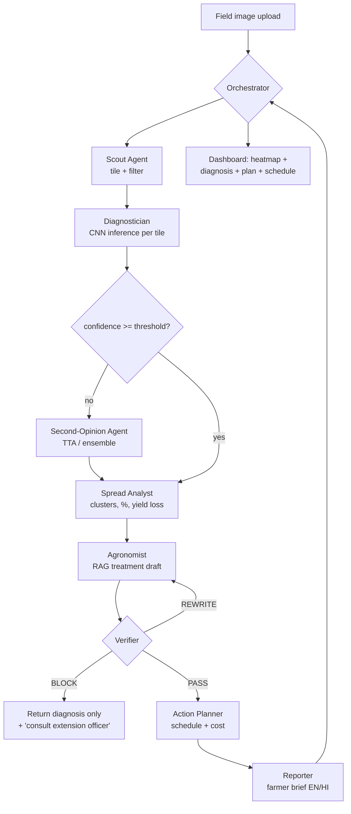

# AgriSentinel — Autonomous Field Health Agent

**Track 4 — Crop disease detection, drone imagery analysis, AI crop recommendation**
2-day AI/ML hackathon · Team of 2 · Multi-agent orchestration core

---

## 1. Problem Analysis

### 1.1 The stated problem
> Farmers cannot detect crop diseases early, leading to major yield losses.

### 1.2 What is actually going wrong (the part judges score)

The problem is **not** "farmers can't identify a leaf." It is a **detection-to-action latency problem**. Break it into four failure points:

| # | Failure point | What happens today | Cost |
|---|---|---|---|
| F1 | **Late detection** | Disease is visible to the naked eye only after it has spread across a patch. Farmers walk a fraction of their field, and only along the edges. | By the time it's noticed, infection is at scale |
| F2 | **Wrong diagnosis** | Many diseases look alike (blight vs. leaf spot vs. nutrient deficiency). Advice comes from neighbours or the shopkeeper selling the chemical. | Wrong chemical → money spent, disease continues |
| F3 | **No spread intelligence** | Even when identified, nobody knows *how much* of the field is affected or which direction it's moving. | Blanket spraying the whole field instead of the infected zone |
| F4 | **No action plan** | "It's leaf blight" is not actionable. Farmer needs: what to apply, how much, when, and what to do next week. | Delay of days between diagnosis and treatment |

### 1.3 Why existing solutions fail

| Existing approach | Why it doesn't solve it |
|---|---|
| Plant-ID mobile apps | Single leaf, single photo, single label. Answers F2 only. No spread, no plan, no field-scale view. |
| Agri-extension officers | Correct but scarce. Days of delay, doesn't scale. |
| Generic LLM chatbots | Will confidently invent a chemical and a dosage. No grounding, no image evidence, dangerous. |
| Satellite NDVI platforms | Field-scale but too coarse and too slow. Tells you crop is stressed, not *which disease*. |

### 1.4 Our reframe — the one-line pitch

> Existing tools classify a **leaf**. AgriSentinel autonomously inspects a **field**, decides how bad it is, and produces a grounded treatment plan — without the farmer clicking through anything.

That reframe is what moves this from "another leaf classifier" to a system. It is also what earns **Problem Clarity (25%)** and **Evidence & Insight (20%)**.

### 1.5 Scope discipline (state this openly to judges)

| In scope for the prototype | Explicitly out of scope |
|---|---|
| 3–5 crops, ~10–15 disease classes | All crops, all diseases |
| Pre-captured drone/field imagery, uploaded | Live drone flight control |
| Grounded advice from a curated agronomy corpus | Legally-binding pesticide prescription |
| Hindi/English farmer-facing output | Full multilingual voice stack |

Naming the boundary is a feasibility signal, not a weakness. It scores under **Feasibility & Path (15%)**.

---

## 2. Solution Overview

A drone/phone image of a field goes in. What comes out, with no further clicks:

1. **Infection map** — heatmap of which tiles of the field are diseased
2. **Diagnosis** — disease name per infected zone, with confidence
3. **Severity + spread** — % field affected, cluster shape, projected spread direction, estimated yield loss
4. **Grounded action plan** — treatment, dosage band, timing, spray sequence, cost estimate
5. **Follow-up schedule** — re-scan date, what to check for
6. **Farmer-readable brief** — short, plain language, local language toggle

The autonomy is the demo: **one upload → the agents run the whole pipeline themselves.**

---

## 3. Multi-Agent Orchestration

### 3.1 Why multi-agent here is justified (not decoration)

Judges penalise "we wrapped 3 prompts and called them agents." Our justification:

- The tasks are **genuinely heterogeneous** — one is a CV inference loop, one is spatial statistics, one is retrieval, one is safety verification. Different tools, different failure modes.
- There is a **real supervisory decision** — the orchestrator decides whether to escalate to a second-opinion pass, whether confidence is high enough to proceed, and whether to block output.
- There is a **hard veto path** — the Verifier can reject the Agronomy Agent's output and force a regeneration. That is an actual control loop, not a pipeline.

### 3.2 Agent roster

| Agent | Type | Input | Output | Tooling |
|---|---|---|---|---|
| **Orchestrator** | Supervisor / router | User upload + agent states | Execution plan, escalation calls, final assembly | Agent framework, state machine |
| **Scout** | Deterministic + CV | Field image | Tile grid, per-tile crop-presence filter | OpenCV tiling, sliding window |
| **Diagnostician** | ML inference | Tiles | Per-tile class + confidence | Fine-tuned CNN (ONNX) |
| **Second-Opinion** | ML inference (conditional) | Low-confidence tiles only | Revised class + confidence | Second model / TTA ensemble |
| **Spread Analyst** | Deterministic analytics | Tile-level labels + coords | % affected, clusters, spread vector, yield-loss estimate | NumPy, DBSCAN, simple growth model |
| **Agronomist** | LLM + RAG | Disease, severity, crop, stage | Treatment plan draft | LLM + vector DB over curated agronomy corpus |
| **Verifier** | LLM / rules (veto power) | Agronomist draft + retrieved sources | PASS / REWRITE / BLOCK + reasons | Claim-to-source matcher, rules on dosage & banned chemicals |
| **Action Planner** | LLM + deterministic | Verified plan | Spray schedule, cost, re-scan date | Calendar logic, cost table |
| **Reporter** | LLM | Everything | Farmer brief (EN/HI), dashboard payload | LLM, template |

### 3.3 Orchestration flow



### 3.4 The Verifier is your differentiator

Every other team's LLM will happily invent a pesticide and a dosage. Ours **cannot ship an unsupported claim**. Every treatment sentence must map to a retrieved chunk from the curated corpus; unmapped sentences are stripped or force a regeneration; chemical names outside an allowlist trigger a BLOCK with a graceful fallback.

Show a live BLOCK in the demo. Deliberately feed a case with no corpus coverage and let the system refuse. **Judges remember the system that knows when to shut up.**

### 3.5 Shared state contract

All agents read/write one event-sourced run object — no agent talks to another directly:

```json
{
  "run_id": "uuid",
  "crop": "tomato",
  "tiles": [
    {"id": "t_04_11", "x": 4, "y": 11, "label": "late_blight",
     "confidence": 0.94, "escalated": false}
  ],
  "spread": {"pct_affected": 18.4, "clusters": 3,
             "direction": "NE", "est_yield_loss_pct": 11.2},
  "plan_draft": "...",
  "verification": {"status": "PASS", "unsupported_claims": [],
                   "sources": ["doc_12#p3", "doc_04#p1"]},
  "schedule": [{"day": 0, "action": "..."}],
  "events": ["scout.done", "diagnose.done", "verify.rewrite", "verify.pass"]
}
```

Print the `events` array in the UI as a live agent log. It makes the orchestration **visible** — critical, because invisible architecture scores zero.

---

## 4. ML Pipeline

### 4.1 Data
- **Base:** PlantVillage (public, labelled, clean) — pick 3–5 crops, 10–15 classes including healthy
- **Realism gap:** PlantVillage is lab-style, single leaf on plain background. Real field images are cluttered. Mitigate with aggressive augmentation: random background compositing, motion blur, brightness/contrast jitter, random crop, JPEG artefacts
- **Field test set:** hand-collect 30–50 real photos (phone camera, actual plants/market produce) as a *held-out realism set*. Reporting accuracy on this separately is a huge honesty signal
- **Drone simulation:** stitch a large field mosaic from tiled leaf images so the Scout Agent has something real to tile

### 4.2 Model
- **Backbone:** EfficientNet-B0 or MobileNetV3-Small, ImageNet pretrained
- **Method:** freeze backbone → train head → unfreeze last blocks, low LR
- **Export:** ONNX for fast CPU inference (no GPU dependency in the demo — this matters when venue wifi/GPU dies)
- **Second-Opinion:** test-time augmentation (flips + crops) averaged, or a second smaller backbone for ensemble disagreement

### 4.3 Metrics to put on a slide

| Metric | Why it's there |
|---|---|
| Overall accuracy + macro F1 | Baseline competence |
| **Per-class precision/recall** | Shows you know which classes are weak |
| **Confusion matrix** | Visual, instantly credible |
| Accuracy on **real-field held-out set** vs. lab set | Honesty about the domain gap — rare and impressive |
| Baseline comparison (from-scratch CNN, or zero-shot VLM) | Proves the fine-tune earned its place |
| Verifier block rate on adversarial prompts | Proves the safety layer works |
| End-to-end latency per field scan | Feasibility |

---

## 5. Tech Stack

| Layer | Choice | Reason |
|---|---|---|
| Model training | PyTorch + torchvision, Colab GPU | Fastest path to a fine-tune |
| Inference | ONNX Runtime | CPU-fast, no GPU at demo time |
| Backend | FastAPI (Python) | Same language as the model, zero glue |
| Agent orchestration | Your agent framework of choice + explicit state machine | Keep the state machine explicit so the flow is debuggable |
| Vector DB | Qdrant (local Docker) or FAISS | You already know Qdrant; FAISS if Docker misbehaves |
| LLM | Fast hosted model (Groq/similar) | Latency matters in a live demo |
| Frontend | React + Tailwind | Heatmap grid, agent log, plan panel |
| Realtime | WebSocket or SSE | Stream agent events live to the UI |
| Storage | SQLite | Zero setup |

---

## 6. Two-Day Execution Plan

> Rule: nothing gets built before Day 1. Research notes, dataset shortlist, wireframes, and the agronomy corpus reading list are allowed in advance.

### Pre-hackathon (allowed)
- Wireframe: upload → heatmap grid → agent log → plan panel
- Bookmark PlantVillage + shortlist the 3–5 crops
- Collect the agronomy source PDFs for the RAG corpus (do not chunk/embed yet)
- Write the demo narrative in one paragraph

### Day 1

| Hours | You (ML + agents) | Teammate (app + integration) |
|---|---|---|
| 0–2 | Dataset download, class selection, augmentation pipeline, start first training run | Repo + FastAPI skeleton, upload endpoint, React shell, wireframe → components |
| 2–5 | Train v1, evaluate, confusion matrix. Export ONNX | Tile grid renderer, image upload → tile display, dummy data plumbing |
| 5–7 | Scout + Diagnostician agents, shared run-state object, event log | WebSocket/SSE event stream, live agent-log UI panel |
| 7–9 | Spread Analyst: clustering, % affected, yield-loss estimate | Heatmap overlay wired to real tile labels |
| 9–10 | **Checkpoint: end-to-end image → heatmap → severity works.** Cut features if not | Same |

**Day 1 must-hit:** upload an image, see a real heatmap driven by a real model. If this isn't true by end of Day 1, drop the RAG layer entirely and go to Cut List Level 2.

### Day 2

| Hours | You (ML + agents) | Teammate (app + integration) |
|---|---|---|
| 0–2 | Chunk + embed agronomy corpus, Agronomist agent with retrieval | Plan panel UI, source-citation chips |
| 2–4 | **Verifier agent** — claim-to-source matching, dosage rules, BLOCK path | BLOCK-state UI, "escalate to expert" fallback screen |
| 4–5 | Action Planner + Reporter, Hindi output toggle | Schedule timeline component, language toggle |
| 5–6 | Second-Opinion escalation path, threshold tuning | Polish, empty states, error handling |
| 6–7 | **Freeze code.** Generate all metric charts | Seed 3 demo cases, verify each runs clean twice |
| 7–8 | Slides: problem → gap → architecture → metrics → impact | Rehearse demo × 3, prepare offline fallback video |
| 8–9 | Dry run in front of each other, kill anything flaky | Same |

### Roles in one line
- **You:** model, agents, orchestration, verifier, metrics
- **Teammate:** API surface, UI, event streaming, demo data, rehearsal
- **Contract between you:** the JSON run-state object in §3.5. Agree on it in hour 1 and freeze it. Teammate builds against mock JSON while your model trains — neither of you blocks the other.

---

## 7. Cut List (drop in this order)

| Level | Drop | Keeps working |
|---|---|---|
| 1 | Hindi output, cost estimate | Everything core |
| 2 | RAG + Verifier → hardcoded treatment lookup table per disease | Full pipeline, weaker safety story |
| 3 | Second-Opinion escalation | Single-pass diagnosis |
| 4 | Spread Analyst → just % affected, no clusters/direction | Heatmap + diagnosis + plan |
| 5 | Drone/tiling → single image classification + plan | Minimum viable demo |

**Never cut:** the heatmap, the agent event log, and the metrics slide. Those three are what the rubric actually rewards.

---

## 8. Three-Minute Demo Script

| Time | Beat |
|---|---|
| 0:00–0:25 | The gap: apps classify a leaf; nobody tells the farmer how bad it is or what to do. Detection-to-action latency. |
| 0:25–0:50 | Upload the field mosaic. Say nothing. Let the agent log scroll on screen while it runs. |
| 0:50–1:30 | Heatmap resolves. 18% affected, 3 clusters, spreading NE, ~11% yield loss. Point at the escalation event in the log. |
| 1:30–2:05 | Grounded plan appears with source chips. Click a chip → show the actual source line. |
| 2:05–2:30 | **The block demo.** Feed the uncovered case. System refuses and escalates instead of inventing a chemical. |
| 2:30–3:00 | Metrics slide: confusion matrix, lab vs. real-field accuracy, latency. Close on the reframe line from §1.4. |

Rehearse until the narration doesn't depend on anything loading fast. **Record a backup video before demo hour.**

---

## 9. Risks

| Risk | Mitigation |
|---|---|
| PlantVillage model collapses on real photos | Report it openly as the lab-vs-field gap, with numbers. Honesty scores higher than a hidden failure. |
| RAG/Verifier eats Day 2 | Cut List Level 2 — hardcoded lookup table, same UI |
| Venue network dies | ONNX runs on CPU locally; keep a local LLM fallback or a canned response path; backup demo video |
| "Is this really multi-agent?" | Point at the Verifier veto loop and the confidence-based escalation — real control flow, not a linear chain |
| Teammate blocked waiting on the model | Frozen JSON contract + mock data from hour 1 |
