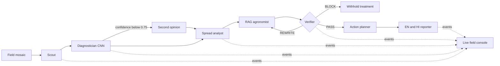
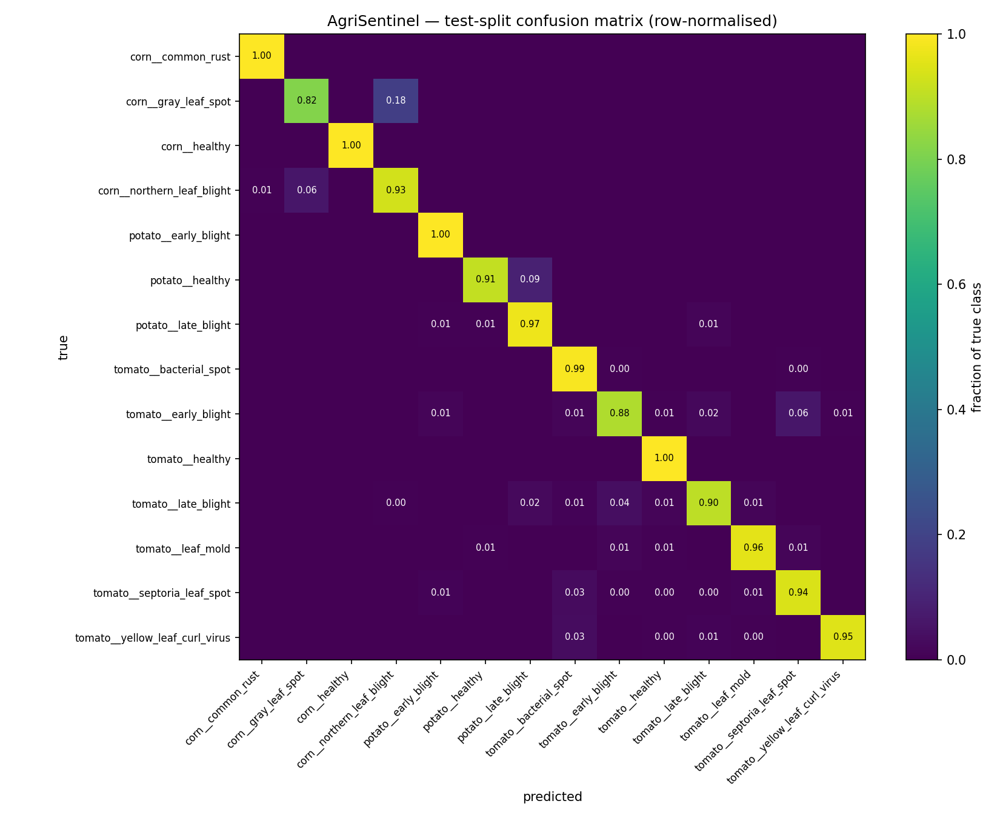
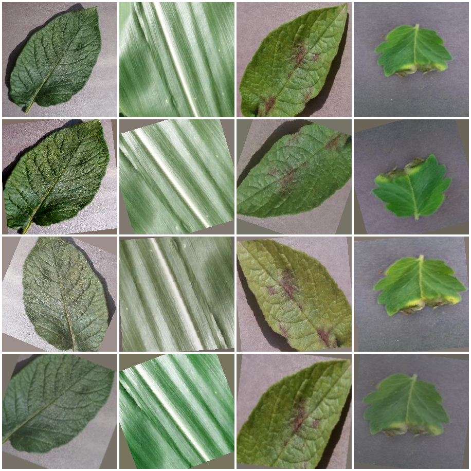

# AgriSentinel — from one leaf to a field decision

Nine-slide, three-minute judging deck. Presenter notes are below each slide and are not spoken verbatim.

---

## 1. The problem: detection-to-action latency

### A farmer does not need another label; they need a safe next action

- A single leaf photo says little about field-scale spread.
- A correct disease name can still lead to unsafe dosage or mistimed treatment.
- Waiting for manual inspection lets an infection front grow.

**AgriSentinel maps where disease is spreading, verifies what can safely be said, and turns it into a timed field plan.**

Presenter note: Open on the operational delay between noticing symptoms and deciding where, when, and whether to act.

---

## 2. Why existing tools stop too early

| Tool | Where it stops |
|---|---|
| Plant-identification app | Labels one image; no field distribution or action schedule |
| General chatbot | Produces fluent advice without a hard evidence or dosage veto |
| Satellite monitoring | Covers area, but often lacks leaf-level disease specificity for small plots |

Presenter note: These are complementary tools. The gap is the verified path from local evidence to field action.

---

## 3. Our reframe

### Classify a leaf → inspect a field

1. Tile a field mosaic into an 8 × 5 inspection grid.
2. Diagnose each scored tile and escalate uncertain predictions.
3. Map affected percentage, clusters, direction, and likely yield impact.
4. Draft treatment from retrieved agronomy sources.
5. Let a Verifier rewrite or veto the plan.
6. Deliver a dated schedule and plain-language farmer brief.

Presenter note: Point to the progressive heatmap while these stages stream in the UI.

---

## 4. Architecture: visible orchestration

Presenter note: The same event consumer accepts live SSE or a recorded offline timer, so backend failure does not change the demo UI.

---

## 5. Why multiple agents: two explicit escalation loops

### Confidence escalation

Tiles below `0.75` confidence go to a Second-Opinion agent instead of silently becoming field truth.

### Evidence escalation

The Verifier checks source grounding and dosage constraints. It can return `REWRITE`, or issue `BLOCK` so diagnosis remains visible while treatment, cost, and schedule are withheld.

**Specialisation is useful here because uncertainty and safety change control flow, not just wording.**

Presenter note: Trigger case 1 to show REWRITE → PASS, then case 3 to show BLOCK as a successful safety outcome.

---

## 6. Model metrics: strong lab baseline, fast CPU path

| PlantVillage test split | Result |
|---|---:|
| Images / classes | 2,399 / 14 |
| Accuracy | 95.6% |
| Macro-F1 | 94.7% |
| Confident-subset accuracy | 99.3% |
| Escalation rate at 0.75 | 15.8% |
| CPU latency, mean per tile | 4.9 ms |

Full class detail: [`ml/artifacts/per_class_table.md`](../ml/artifacts/per_class_table.md). Latency source: [`ml/artifacts/latency.md`](../ml/artifacts/latency.md).

Presenter note: Say “PlantVillage test split” before the number. The fine-tuned model improves macro-F1 by 2.6 points over the same-project from-scratch baseline.

---

## 7. Honesty: lab accuracy is not field accuracy

### What is measured

- 95.6% accuracy and 94.7% macro-F1 on a clean PlantVillage test split.
- A 15.8% low-confidence escalation rate at the selected threshold.

### What is not measured yet

- Accuracy on original phone photos with clutter, blur, shadows, mixed leaves, soil, and partial symptoms.
- Calibration across devices, regions, cultivars, and field conditions.

### Our evidence plan

Collect 30–50 untouched real crop photos, hand them to Dev A, and report the measured lab-to-field gap here—even if it is large.

Presenter note: Do not substitute augmentation samples or synthetic demo mosaics for real field evidence.

---

## 8. Safety: refusal is a product outcome

The Verifier blocks advice when the crop/disease is outside the verified corpus or when dosage claims fail the allowlist/source check.

In a BLOCK run, AgriSentinel still shows:

- the inspected grid and diagnosis context;
- the plain-language reason for refusal;
- a safe referral in English and Hindi.

It does **not** show treatment instructions, schedule, cost, or rescan prescription.

**Adversarial block-rate metric: pending a labelled prompt/case matrix.** The prepared clean-basil case proves the UI and control path, not a statistical rate.

Presenter note: Press `3`. Explicitly say the system completed successfully by refusing an out-of-scope recommendation.

---

## 9. Impact and next deployment boundary

### Prototype boundary

Tomato, potato, and corn; three prepared offline scenarios; treatment grounded only in the available corpus.

### Near-term path

- Build and publish the real-field benchmark.
- Calibrate confidence thresholds by crop and device.
- Add weather, label/regulatory region, and extension-officer review.
- Track repeat scans to measure whether spread actually slows.

### Intended impact

Shorten the path from visible symptoms to a targeted, explainable, and safer field response—without pretending a prototype is an agronomist.

Presenter note: Close on the measured next step: real-field validation, not a broader feature list.
